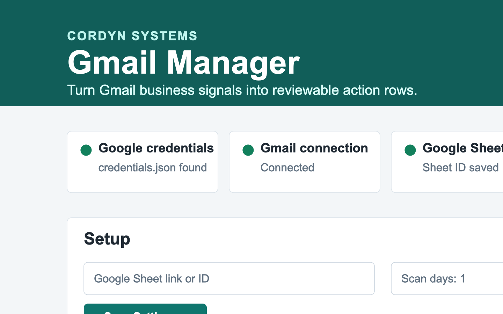
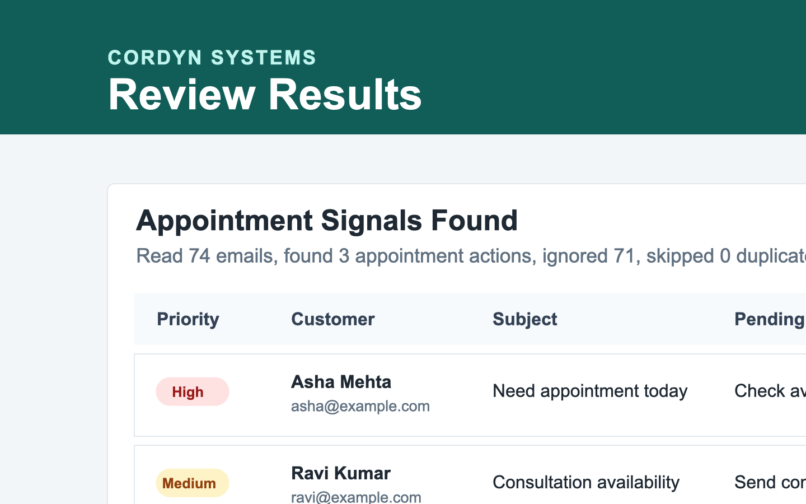
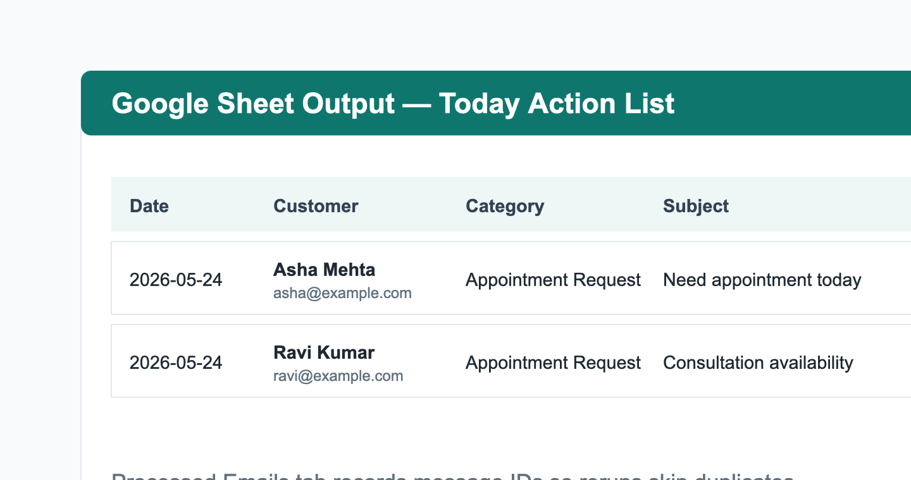

# Gmail Manager: Business Signal-to-Action Engine

Most small businesses do not need another dashboard.

They need a simple way to notice what is slipping through the cracks.

Gmail Manager is an open-source experiment by **Cordyn Systems** that converts business Gmail messages into structured operational actions.

The first version focuses on appointment-related signals using local Ollama/Gemma classification and Google Sheet output. The larger direction is a lightweight business signal-to-action layer for small and mid-sized businesses.

## Why this matters

Small businesses receive important operational signals every day:

- a customer asking for an appointment
- a booking request waiting for confirmation
- a missed follow-up
- a complaint that needs attention
- a customer asking to call or meet
- a payment or service message requiring action

These signals often remain buried inside inboxes.

This project explores how local AI can extract useful business intent from Gmail and convert it into a daily action sheet.

## What it does

- Reads recent Gmail messages using the Gmail API with read-only access.
- Uses local Ollama/Gemma to identify appointment-related business signals.
- Filters obvious automated emails before local AI review.
- Shows appointment actions in a local browser app before writing to Sheets.
- Writes approved rows to a configured Google Sheet.
- Tracks processed Gmail message IDs to avoid duplicates.
- Provides one-click local install/start/stop scripts for macOS and Windows.

## What it does not do

- Does not send emails.
- Does not delete emails.
- Does not archive Gmail messages.
- Does not modify Gmail labels.
- Does not change anything inside Gmail.
- Does not send email content to OpenAI or paid AI APIs.
- Does not act as a full CRM.

## Screenshots

### Local Browser App



### Preview Before Writing to Sheet



### Google Sheet Output



## Signal Filtering

The current MVP focuses on appointment-related business signals.

This is intentional: appointment workflows are common across clinics, coaching centers, consultants, service providers, salons, repair centers, and small offices.

Future versions can extend the same signal-to-action pipeline to other business signals:

- revenue enquiries
- payment follow-ups
- service risk messages
- response gaps
- calendar events
- WhatsApp exports
- CCTV activity summaries

## Local-first architecture

```text
Gmail read-only API
  -> automated email prefilter
  -> local Ollama/Gemma signal classification
  -> preview in browser app
  -> Google Sheet action output
  -> processed message log
```

The app is designed for local desktop use. Google OAuth files, tokens, local settings, pending previews, and processed logs stay on the user's computer and are ignored by git.

## Project structure

```text
gmail-manager/
  web_app.py
  README.md
  TEST_PLAN.md
  LICENSE
  .env.example
  requirements.txt
  pyproject.toml
  Install Gmail Manager.command
  Start Gmail Manager.command
  Stop Gmail Manager.command
  Install Gmail Manager.bat
  Start Gmail Manager.bat
  Stop Gmail Manager.bat
  src/
    appointment_llm.py
    classifier.py
    config.py
    dedupe.py
    gmail_client.py
    main.py
    models.py
    sample_runner.py
    sheets_client.py
  templates/
    dashboard.html
    login.html
    setup_pin.html
  static/
    styles.css
  docs/
    gmail_setup.html
    dashboard.png
    preview.png
    sheet-output.png
  data/
    sample_emails.csv
  tests/
```

## One-click local setup

On macOS:

```text
Double-click Install Gmail Manager.command
```

On Windows:

```text
Double-click Install Gmail Manager.bat
```

The installer:

- creates or reuses a local Python virtual environment
- installs dependencies
- checks Ollama
- opens the setup guide
- starts the local web app

The local app runs at:

```text
http://127.0.0.1:5055
```

## Browser app flow

1. Create a local PIN/password.
2. Upload the Google OAuth JSON file.
3. Paste a Google Sheet URL or Sheet ID.
4. Connect Gmail through Google OAuth.
5. Run a sample scan.
6. Scan Gmail.
7. Review appointment actions.
8. Write approved rows to Google Sheets.

The dashboard also includes privacy notes and clear-local-data controls.

## Google Cloud setup

The app needs:

- Gmail API
- Google Sheets API
- OAuth Desktop App credentials

The Gmail integration uses read-only scope:

```text
https://www.googleapis.com/auth/gmail.readonly
```

The Sheets integration uses:

```text
https://www.googleapis.com/auth/spreadsheets
```

See the detailed setup guide:

[docs/gmail_setup.html](docs/gmail_setup.html)

## Environment variables

Copy `.env.example` to `.env` for CLI/local overrides:

```text
GOOGLE_CREDENTIALS_FILE=credentials.json
GOOGLE_TOKEN_FILE=token.json
GOOGLE_SHEET_ID=
PROCESSED_LOG_FILE=processed_emails.csv
OUTPUT_CSV_FILE=output_action_list.csv
OLLAMA_HOST=http://127.0.0.1:11434
OLLAMA_MODEL=gemma4:e4b
```

The browser app can also store these settings in its local `web_settings.json` file, which is git-ignored.

## CLI usage

The browser app is recommended for normal users, but CLI commands remain available.

Sample mode:

```bash
python src/main.py --mode sample --output-csv
```

Gmail mode:

```bash
python src/main.py --mode gmail --days 1
```

Rebuild the action sheet from recent emails:

```bash
python src/main.py --mode gmail --days 1 --reprocess --reset-action-list
```

## Google Sheet tabs

The script creates or updates 3 tabs.

### Today Action List

```text
Date
Customer Name
Customer Email
Category
Subject
Summary
Pending Action
Priority
Status
Gmail Message ID
Added On
```

### Processed Emails

```text
Gmail Message ID
Date
From
Subject
Snippet
Category
Added On
```

### Settings

```text
Setting
Value
```

## Run tests

```bash
pytest
```

Current local suite:

```text
16 tests
```

See the detailed local test plan:

[TEST_PLAN.md](TEST_PLAN.md)

## Roadmap

### V0.1 — Appointment Signal Detection

- Gmail read-only connector
- Local Ollama/Gemma signal filtering
- Google Sheet action output
- Duplicate prevention
- Browser-based local app

### V0.2 — Business Signal Categories

- Revenue signals
- Scheduling signals
- Cashflow signals
- Service risk signals
- Response gaps

### V0.3 — Google Calendar Integration

- Appointment cross-checking
- Slot confirmation detection
- Missed appointment follow-up

### V0.4 — Daily Business Digest

- End-of-day owner summary
- Missed follow-up detection
- Priority scoring

### Future Direction

- WhatsApp export support
- Web form signals
- CCTV activity summaries
- Multi-location small-business operations assistant

## Support & customization

This repository is built as an open-source experiment for practical small-business process automation.

For customization, pilot implementation, or business workflow adaptation, contact: hello.cordyn.systems@gmail.com
